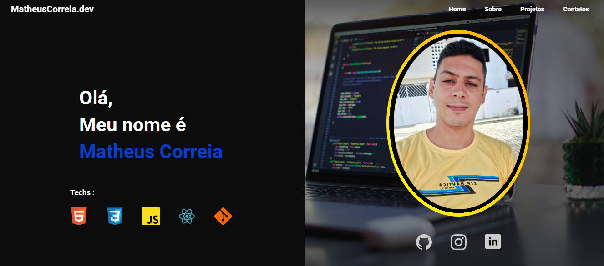
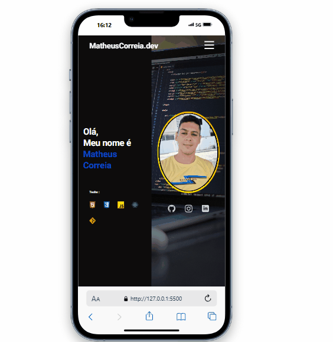

# Matheus Correia - Portfólio

Esse projeto foi feito com muito carinho a fim de me apresentar como Desenvolvedor Web ❤️

## Características

- Layout com múltiplas seções em uma única página 📑

- Totalmente responsivo em todos os dispositivos 💻📱

- Download do meu currículo em pdf 📂

## Preview

### Captura de Tela Desktop

### Captura de Tela Mobile

### Links

💻 Página do Portfólio: [aqui](https://matheuscorreiadev.github.io/portfolio)

## Meu Processo

### <h2>🛠️ Construído com</h2>

- HTML5 
- CSS3
- JavaScript
- Google Fonts